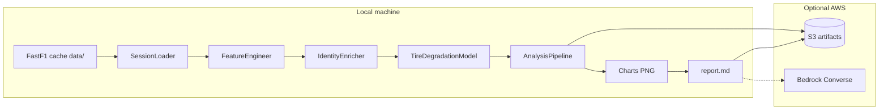

# DeltaPace

**DeltaPace** is a deterministic Formula 1 analytics pipeline that turns raw timing data into a fan-readable race story: tyre degradation models, team-coloured charts, and a Markdown report — runnable entirely offline on your laptop.

## What it does

For any FastF1 session (year / Grand Prix / session code), DeltaPace:

1. **Ingests** lap times and weather via FastF1 (local cache in `data/`)
2. **Engineers features** — fuel burn-down correction, tyre age, track temperature
3. **Enriches identity** — real driver names, team colours, grid/finish
4. **Models degradation** — scikit-learn regression: seconds lost per lap of tyre wear
5. **Charts** — degradation bars, team pace, tyre wear curves (PNG)
6. **Writes a report** — offline mock template by default; Amazon Bedrock when configured

## Architecture



| Layer | Module | Role |
|-------|--------|------|
| Config | `src/config.py` | Paths, AWS, Bedrock, ML thresholds |
| Ingest | `src/pipeline/ingest.py` | FastF1 fetch + local cache |
| Features | `src/pipeline/features.py` | Fuel + temperature features |
| Identity | `src/pipeline/identity.py` | Names, colours, team rankings |
| ML | `src/models/regression.py` | Tyre degradation regression |
| Orchestration | `src/pipeline/analysis.py` | End-to-end `AnalysisPipeline` |
| Report | `src/report/writer.py` | Markdown narrative (mock / Bedrock) |
| Charts | `src/report/charts.py` | Matplotlib figures |
| Storage | `src/storage/s3.py` | Optional S3 upload |
| CLI | `src/run.py` | `python -m src.run` |

## Setup

```bash
python -m venv .venv
.venv\Scripts\activate          # Windows
# source .venv/bin/activate     # macOS/Linux

pip install -r requirements.txt
pip install -r requirements-dev.txt   # for tests

copy .env.example .env            # Windows
# cp .env.example .env            # macOS/Linux
```

Default `.env` values run **fully offline**:

- `DELTAPACE_MOCK_LLM=true` — local report template, no Bedrock
- `DELTAPACE_USE_S3=false` — no cloud uploads
- FastF1 cache writes to `data/` (gitignored)

## Run an analysis

```bash
python -m src.run --year 2023 --gp Monza --session R
```

Options:

| Flag | Description |
|------|-------------|
| `--year`, `--gp`, `--session` | Race selector (defaults: 2023 Bahrain R) |
| `--bionic` | Bionic bold styling on the report |
| `--no-charts` | Skip PNG generation |
| `--upload` / `--no-upload` | S3 upload when bucket + creds configured |
| `-v` | Debug logging |

Output lands in `reports/{year}-{gp}-{session}/`:

- `report.md` — narrative analysis
- `charts/` — degradation bars, team pace, tyre curves

## AWS (optional)

| Variable | Purpose |
|----------|---------|
| `DELTAPACE_S3_BUCKET` | Artifact bucket |
| `DELTAPACE_USE_S3=true` | Enable uploads |
| `DELTAPACE_BEDROCK_MODEL_ID` | Bedrock model for live reports |
| `DELTAPACE_MOCK_LLM=false` | Use Bedrock instead of template |

S3 layout:

```
s3://{bucket}/{prefix}/processed/{year}/{gp}/{session}/  ← CSV artifacts
s3://{bucket}/{prefix}/reports/{year}/{gp}/{session}/    ← report + charts
```

FastF1 cache **always stays local** — S3 stores finished artifacts only.

## Tests

```bash
pytest
```

All tests use synthetic data — no network or AWS required.

## Roadmap

| Phase | Status | Focus |
|-------|--------|-------|
| 1–2 | Done | Pipeline, AWS config, S3 storage |
| 3 | Done | Identity enrichment + degradation ML |
| 4 | Done | Orchestration, charts, report, CLI |
| 5+ | Planned | 2-stop vs 3-stop crossover, strategy simulation |
| 6 | Future | Streamlit interactive dashboard |

## License

Add your license here.
